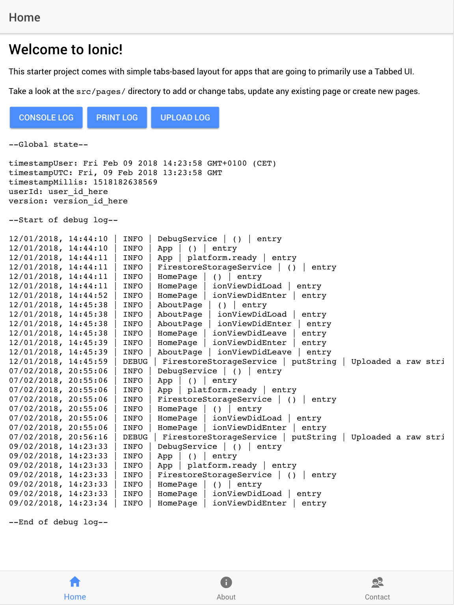
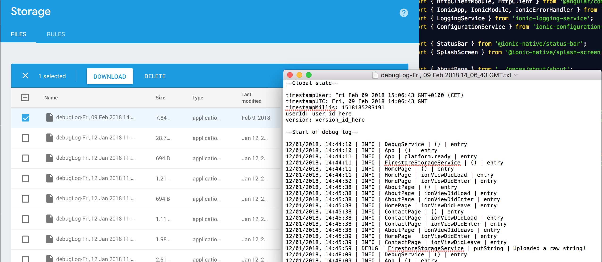

# Ionic Device Debug Logging Template

This Ionic3 project stores all log messages locally on the user's mobile device (in localStorage) and lets the user upload this as string to the cloud (a file in Firebase  Cloud Storage is created) for your inspection. Why? Running Ionic apps on mobile devices leads to many unexpected app behaviours due to the very nature of being mobile. It is often complicated to identify misbehaviours, especially if the app is not crashing or since the app is killed at unpredictable times by the OS or by the user. In these situations, it is often desired to inspect the flow of the user through the app using a log file containing Ionic lifecycle calls, method calls, events, states, etc. 

## Features

Current features:
* Centralised logging mechanism on user's device (app stores log messages locally using localStorage)
* Log file upload (for uploading localStorage content from device to Firebase Cloud Storage)

Roadmap:
* Field test localStorage with users over time to determine limitations, especially on iOS
* Investigate SQLite alternative using Ionic native plugin
* Investigate File IO alternative using Ionic native plugin
* Unit testing

Ionic pages included:
* Non-interesting pages (Home, About, Contact) from the `tabs` starter teomplate

Ionic services included:
* debug.service.ts: centralised logging mechanism (DEBUG, INFO, WARN, ERROR)
* fs-storage.service.ts: handles uploads to Firebase/Firestore

## Screenshot

_img1: The screenshot (iPad resolution) shows the user flow of 3 consecutive app visits, identified by the initial loading of the DebugService as this service is already initiated in the app.component.ts_

_img2: The screenshot shows the Cloud Storage backend where logs uploaded by a user is stored in separate files (left) and example of the contents of such a log file (right)_

## Usage

1. Download/clone this Ionic project

2. Include the two Ionic plugins listed in the Acknowledgements section

3. Edit Firebase/Firestore details:
Setup your own Firebase/Firestore project in the Firebase/Firestore Console. 
After setting up your own Firestore/Firestore project, please replace the details in  `src/environments/environment.ts` with your own including `apiKey`, `authDomain`, `databaseURL`, `projectId`, `storageBucket`, `messagingSenderId`. 

4. Run `ionic serve` for a local dev server. Navigate to `http://localhost:8100/`. The app will automatically reload if you change any of the source files.

## Acknowledgements

This project builds upon the following two projects by Ritzlgrmft
* ionic-logging-service: encapsulates log4javascript's functionalities for apps built with Ionic framework (https://github.com/Ritzlgrmft/ionic-logging-service)  
* ionic-configuration-service: externalises configuration functionalities for apps built with Ionic framework (https://github.com/Ritzlgrmft/ionic-configuration-service)
